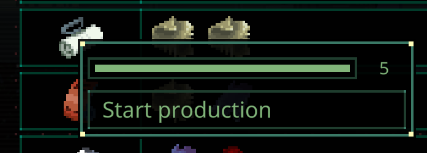

# Quasimorph Production Tweaks

# Important - This version of the mod is only for the opt in beta version of the game!

This is a temporary version that supports the 0.8.6 beta, and not the current game's version.
For the non beta version of the game, use the mod of the same name without the BETA suffix.

The non beta version *must* be uninstalled.  
When the 0.8.6 becomes the main version, this mod will be deleted.
Note that the beta is expected to change many times before release.
As such, this mod may break on each beta release.

# Docs

Remembers the location of the production item selection window.  For example, when selecting sorbent, returning to the screen keeps the view at the sorbent location.

Defaults to the max amount for the production count instead of one.  For example, 60 rounds.

# Support
If you enjoy my mods and want to buy me a coffee, check out my [Ko-Fi](https://ko-fi.com/nbkredspy71915) page.
Thanks!

# Source Code
Source code is available on GitHub at https://github.com/NBKRedSpy/QM_ProductionTweaks

# Change Log

## 1.1.0
Compatible with the 0.8.6 opt in beta
