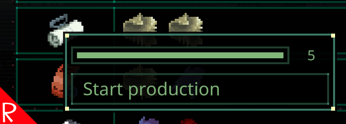

# Quasimorph Production Tweaks

Remembers the location of the production item selection window.  For example, when selecting sorbent, returning to the screen keeps the view at the sorbent location.

Defaults to the max amount for the production count instead of one.  For example, 60 rounds.

# Support
If you enjoy my mods and want to buy me a coffee, check out my [Ko-Fi](https://ko-fi.com/nbkredspy71915) page.
Thanks!

# Source Code
Source code is available on GitHub at https://github.com/NBKRedSpy/QM_ProductionTweaks

# Change Log

## 1.2.0
* Restores last filter that was used. 

## 1.1.0
* Compatible with the 0.8.6 opt in beta
